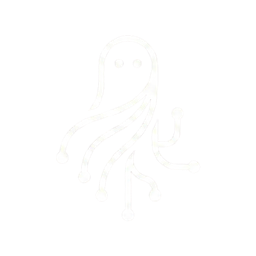

<p align="center">
  
</p>

<h1 align="center">Pnevma</h1>

<p align="center">
  A native macOS workspace for supervising CLI coding agents on real software projects.
</p>

<p align="center">
  <a href="https://pnevma.dev">pnevma.dev</a>
</p>

<p align="center">
  <a href="https://github.com/salexandr0s/pnevma/actions/workflows/ci.yml"></a>
  <a href="https://pnevma.dev"></a>
  
  
  
</p>

---

Pnevma gives you one place to open a repository, supervise CLI coding agents in real terminals, review what they changed, and decide when that work is ready to merge.

> Status: Pnevma currently targets Apple Silicon Macs on macOS 14+. Source builds are supported today. The first public `arm64` DMG for `v0.2.0` is planned to be Developer ID signed but not notarized, so first launch on a clean Mac may require Finder `Open` or System Settings `Open Anyway`.

## Why Pnevma

Pnevma is built for developers who want agent speed without giving up control of the repository.

- Real terminals, not simulated sandboxes. Agents run in managed Ghostty-backed sessions with scrollback, replay, and restore behavior.
- One task, one branch, one worktree. Parallel agent work stays isolated and reviewable.
- Review is part of the product. Diff inspection, review packs, checks, and merge queue mechanics are built into the workflow.
- Native macOS UI, Rust-owned workflow logic. The desktop app stays thin while the backend owns orchestration, persistence, and safety rules.
- Durable operator state. Tasks, sessions, events, and artifacts are persisted so the app can recover context instead of treating every run as ephemeral.

## Current Product Surface

Pnevma already exposes the core operator surfaces needed to run day-to-day agent work:

- Workspace Opener for starting from a prompt, an existing folder, GitHub issues, pull requests, branches, or a remote SSH target
- Workspace and project overview data for GitHub state, automation state, sessions, and operator context
- Task Board for dispatch, triage, and status tracking
- Managed terminal supervision with embedded [Ghostty](https://ghostty.org), replay, and restore across relaunch
- Review, diff, and merge queue flows for deciding what ships
- SSH manager with key handling, profiles, Tailscale discovery, and remote durable session support
- Command Center, tool drawer, notifications, daily brief, analytics, ports, rules, secrets, and settings surfaces for broader supervision

## How The Loop Works

1. Open a repository and initialize `pnevma.toml` if needed.
2. Create or import work, then let Pnevma create a dedicated worktree for that task.
3. Launch an agent such as Claude Code or Codex in a managed terminal session.
4. Let the Rust backend track task state, session state, artifacts, and events in SQLite plus the append-only event log.
5. Inspect output, diffs, review packs, and checks in the native UI.
6. Approve, reject, queue, or merge the work when it meets the bar.

The important boundary is unchanged: Pnevma isolates agent work by git worktree, not by OS sandbox. Agents still run with the current user's filesystem and network access.

## Architecture At A Glance

Pnevma is a native Swift/AppKit application backed by a Rust workspace.

- `native/`: pane-based macOS UI, workspace chrome, terminal host views, and operator tools
- `crates/pnevma-bridge`: C FFI bridge compiled into `libpnevma_bridge.a`
- Rust workspace crates: task orchestration, session supervision, git/worktree management, agent adapters, context compilation, database access, SSH and remote helper management, tracking, remote access, and redaction
- `SQLite + event log`: durable task, session, review, notification, and audit state
- [`Ghostty`](https://ghostty.org): embedded terminal runtime compiled as an xcframework

The Swift app renders state and invokes commands. The Rust backend owns workflow logic, persistence, automation, remote access, and safety-sensitive behavior.

## Build From Source

### Prerequisites

- Rust via `rustup` using the toolchain pinned in `rust-toolchain.toml`
- Zig matching `.zig-version`
- `just`
- XcodeGen
- Xcode 26+ with the macOS SDK
- Git
- At least one supported agent CLI on `PATH` (`claude-code` or `codex`)

### Quickstart

```bash
git clone https://github.com/salexandr0s/pnevma.git
cd pnevma

./scripts/bootstrap-dev.sh
just build
just ghostty-smoke
```

For interactive development:

```bash
open native/Pnevma.xcodeproj
```

## Installing The First Public DMG

The first public `v0.2.0` DMG is expected to be signed but not notarized yet.

That means macOS may block the first launch on a clean machine even though the app is signed. The intended install flow is:

1. Mount the DMG and drag `Pnevma.app` into `/Applications`.
2. In Finder, open `/Applications`, right-click `Pnevma.app`, and choose `Open`.
3. Confirm the `Open` dialog.
4. If macOS still blocks the app, open **System Settings → Privacy & Security** and use **Open Anyway**, then launch again.

Subsequent launches should work normally after that first approval.

## Configuration

Project configuration lives in `pnevma.toml`. Typical controls include the default provider, concurrency, worktree naming, retention, automation, remote access, redaction, and issue-tracker integration.

See the [`pnevma.toml` reference](docs/pnevma-toml-reference.md) for the current schema.

## Documentation

Start with the [documentation index](docs/README.md), then use these entry points:

- [Product Tour](docs/product-tour.md): a guided walk through the current operator surfaces
- [Getting Started](docs/getting-started.md): bootstrap, local setup, and first workspace flow
- [Architecture Overview](docs/architecture-overview.md): system boundaries and runtime paths
- [`pnevma.toml` Reference](docs/pnevma-toml-reference.md): project and global configuration
- [Security Deployment Guide](docs/security-deployment.md): remote access posture and credential handling
- [Remote Access Guide](docs/remote-access.md): TLS, auth, CORS, and runtime controls for the remote API surface
- [macOS Release Runbook](docs/macos-release.md): signing, DMG packaging, first-launch instructions, and release evidence
- [Implementation Status](docs/implementation-status.md): current repo status and priorities

## Security And Operating Model

- Worktrees isolate repository changes, not operating-system privileges
- Agents run with the current user's filesystem and network permissions
- Remote access is optional and disabled unless configured
- Remote session input is opt-in
- Sensitive output paths are protected by redaction middleware
- The first public `v0.2.0` DMG is expected to be signed but not notarized, with documented first-launch bypass instructions for clean Macs

## Acknowledgments

Pnevma's terminal is powered by [Ghostty](https://ghostty.org), the fast, feature-rich terminal emulator created by [Mitchell Hashimoto](https://github.com/mitchellh). Ghostty is compiled from source using Zig and embedded as an xcframework, giving Pnevma a native GPU-accelerated terminal without reinventing terminal emulation. Ghostty's quality is a big part of what makes Pnevma feel right.

## Links

- [Website](https://pnevma.dev)
- [GitHub Repository](https://github.com/salexandr0s/pnevma)
- [Documentation](docs/README.md)

## License

Dual-licensed under MIT or Apache-2.0, at your option.
